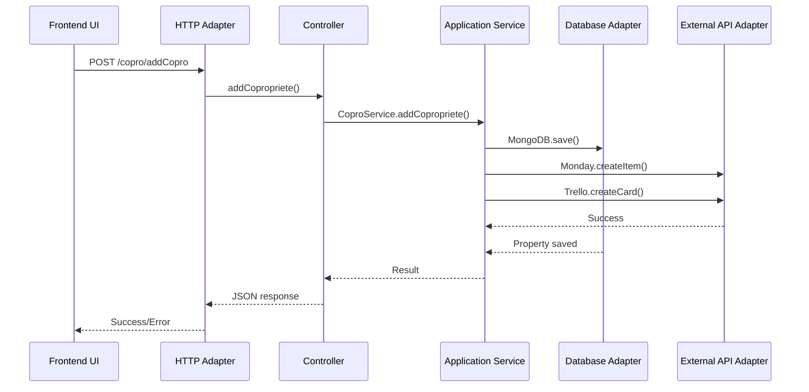

# CoproxDashboard - Hexagonal Architecture Documentation

## 🏗️ Architecture Overview

CoproxDashboard implements the **Hexagonal Architecture** (also known as Ports and Adapters pattern) to create a maintainable, testable, and loosely-coupled system. This architectural pattern allows the application's core business logic to remain independent of external concerns like databases, web frameworks, and third-party APIs.

## 🔧 Core Principles

### 1. Separation of Concerns
- **Domain Logic**: Pure business rules and entities
- **Application Services**: Use cases and application-specific logic
- **Infrastructure**: External dependencies and adapters

### 2. Dependency Inversion
- Core domain depends on nothing
- Infrastructure depends on domain interfaces
- Application orchestrates between domain and infrastructure

### 3. Ports and Adapters
- **Ports**: Interfaces defining what the application needs
- **Adapters**: Implementations of ports for specific technologies

## 📐 Architecture Layers

```
┌─────────────────────────────────────────────────────────────┐
│                    EXTERNAL SYSTEMS                        │
│  ┌─────────┐ ┌─────────┐ ┌─────────┐ ┌─────────┐          │
│  │ MongoDB │ │ Trello  │ │ Monday  │ │ Zendesk │   ...    │
│  └─────────┘ └─────────┘ └─────────┘ └─────────┘          │
└─────────────────────────────────────────────────────────────┘
                            │
┌─────────────────────────────────────────────────────────────┐
│                   INFRASTRUCTURE LAYER                     │
│  ┌──────────────┐ ┌──────────────┐ ┌──────────────────┐    │
│  │   Database   │ │     HTTP     │ │   External APIs  │    │
│  │   Adapters   │ │   Adapters   │ │    Adapters      │    │
│  └──────────────┘ └──────────────┘ └──────────────────┘    │
└─────────────────────────────────────────────────────────────┘
                            │
┌─────────────────────────────────────────────────────────────┐
│                   APPLICATION LAYER                        │
│  ┌──────────────┐ ┌──────────────┐ ┌──────────────────┐    │
│  │ Controllers  │ │   Services   │ │      Routes      │    │
│  │   (HTTP)     │ │  (Use Cases) │ │   (Endpoints)    │    │
│  └──────────────┘ └──────────────┘ └──────────────────┘    │
└─────────────────────────────────────────────────────────────┘
                            │
┌─────────────────────────────────────────────────────────────┐
│                     DOMAIN LAYER                           │
│  ┌──────────────┐ ┌──────────────┐ ┌──────────────────┐    │
│  │   Models     │ │   Business   │ │    Domain        │    │
│  │ (Entities)   │ │    Logic     │ │   Services       │    │
│  └──────────────┘ └──────────────┘ └──────────────────┘    │
└─────────────────────────────────────────────────────────────┘
```

## 🎯 Implementation in CoproxDashboard

### Domain Layer (Core)

#### Models/Entities (`/server/src/models/`)
These represent the core business entities with their properties and relationships:

```javascript
// copropriete.js - Core Property Entity
const CoproprieteSchema = new mongoose.Schema({
    idCopro: { type: String, required: true },
    Nom: { type: String, required: true },
    ville: { type: String, required: true },
    status: { type: String, required: false },
    // ... other domain properties
});
```

**Key Domain Models:**
- `copropriete.js` - Property management entity
- `person.js` - Contact/person entity
- `fiche.js` - Document/file entity
- `user.js` - User entity
- `suiviag.js` - Follow-up tracking entity

### Application Layer (Use Cases)

#### Services (`/server/src/services/`)
Contains business logic and use cases, orchestrating between domain and infrastructure:

```javascript
// coproService.js - Property Management Use Cases
class CoproService {
    // Use case: List all active properties
    static async listCopropriete() {
        return connectAndExecute(async () => {
            const coproprieteCollection = MongoDB.getCollection('copropriete');
            const results = await coproprieteCollection.find({ 
                status: { $ne: 'Inactif' } 
            }).toArray();
            return results;
        });
    }
    
    // Use case: Synchronize with external systems
    static async syncWithMonday(coproprieteId) {
        // Business logic for synchronization
    }
}
```

**Key Application Services:**
- `coproService.js` - Property management use cases
- `trelloService.js` - Trello integration use cases
- `mondayService.js` - Monday.com integration use cases
- `zendeskService.js` - Support ticket use cases
- `vilogiService.js` - Vilogi synchronization use cases

#### Controllers (`/server/src/controllers/`)
HTTP adapters that translate web requests to application service calls:

```javascript
// coproController.js - HTTP Adapter for Property Use Cases
async function listCopropriete(req, res) {
    try {
        const result = await CoproService.listCopropriete();
        res.json(result);
    } catch (error) {
        console.error('Error:', error.message);
        res.status(500).json({ error: 'Internal Server Error' });
    }
}
```

#### Routes (`/server/src/routes/`)
Define HTTP endpoints and map them to appropriate controllers:

```javascript
// coproRoutes.js - HTTP Route Definitions
const router = express.Router();

router.get('/listCopro', CoproController.listCopropriete);
router.get('/detailsCopro/:id', CoproController.detailsCopropriete);
router.post('/addCopro', CoproController.addCopropriete);
router.put('/editCopro/:id', CoproController.editCopropriete);
```

### Infrastructure Layer (Adapters)

#### Database Adapter (`/server/src/utils/mongodb.js`)
Handles database connectivity and provides abstraction over MongoDB:

```javascript
class MongoDB {
    static async connectToDatabase() {
        // MongoDB connection logic
        const uri = `mongodb+srv://${username}:${password}@${clusterName}/${dbName}`;
        await mongoose.connect(uri);
        return mongoose.connection;
    }
    
    static getCollection(collectionName) {
        // Return collection instance
        return mongoose.connection.db.collection(collectionName);
    }
}
```

#### External API Adapters
- **Trello Adapter**: Integrates with Trello API for project management
- **Monday.com Adapter**: Connects to Monday.com for task management
- **Zendesk Adapter**: Handles support ticket operations
- **Vilogi Adapter**: Synchronizes property data
- **Dropbox Adapter**: Manages file storage and backup

#### Cron Jobs (`/server/src/cron/`)
Scheduled tasks that handle automated processes:

```javascript
// cronStart.js - Scheduled Task Adapter
const scheduleCronJobs = () => {
    // Schedule property synchronization
    cron.schedule('0 2 * * *', async () => {
        await syncAllProperties();
    });
    
    // Schedule backup operations
    cron.schedule('0 1 * * *', async () => {
        await backupDatabase();
    });
};
```

## 🔌 Ports and Adapters Detail

### Primary Ports (Driving Side)

#### HTTP Port
- **Interface**: HTTP endpoints
- **Adapter**: Express.js controllers and routes
- **Purpose**: Handles web requests from frontend

#### Scheduled Tasks Port
- **Interface**: Cron job definitions
- **Adapter**: node-cron implementation
- **Purpose**: Handles time-based automation

### Secondary Ports (Driven Side)

#### Database Port
- **Interface**: Data persistence operations
- **Adapter**: MongoDB with Mongoose
- **Purpose**: Store and retrieve application data

#### External API Port
- **Interface**: Third-party service integration
- **Adapters**: 
  - Trello API client
  - Monday.com API client
  - Zendesk API client
  - Vilogi API client
- **Purpose**: Integrate with external systems

#### File Storage Port
- **Interface**: File operations
- **Adapter**: Dropbox API / Local filesystem
- **Purpose**: Handle document storage and retrieval

#### Logging Port
- **Interface**: Logging operations
- **Adapter**: Winston logger
- **Purpose**: Application monitoring and debugging

## 🎨 Frontend Architecture

The frontend follows a component-based architecture with clear separation:

### Presentation Layer
```
src/
├── components/          # Reusable UI components (adapters)
│   ├── Sidebar.js
│   ├── DashboardBox.js
│   └── PieChart.js
├── containers/          # Page-level components (ports)
│   ├── HomePage.js
│   ├── Copro.js
│   └── DetailCopro.js
└── utils/
    └── api.js          # HTTP client adapter
```

### Frontend Ports and Adapters

#### HTTP Client Port
- **Interface**: API communication
- **Adapter**: Axios HTTP client
- **Purpose**: Communicate with backend APIs

#### UI Component Port
- **Interface**: User interface rendering
- **Adapter**: React components with Material-UI
- **Purpose**: Present data to users and handle interactions

#### State Management Port
- **Interface**: Application state
- **Adapter**: React Hooks (useState, useEffect)
- **Purpose**: Manage component and application state

## 🔄 Data Flow Example

### Property Creation Flow

1. **User Action**: User submits property form in frontend
2. **HTTP Adapter**: Frontend sends POST request to `/copro/addCopro`
3. **Route Handler**: Express route maps request to controller
4. **Controller**: `addCopropriete` controller method called
5. **Application Service**: `CoproService.addCopropriete()` executes business logic
6. **Database Adapter**: MongoDB adapter persists property data
7. **External API Adapters**: Sync property with Monday.com and Trello
8. **Response**: Success/error response sent back through layers



## 🧪 Testing Strategy

### Unit Testing
- **Domain Logic**: Test business rules in isolation
- **Services**: Test use cases with mocked dependencies
- **Controllers**: Test HTTP handling with mocked services

### Integration Testing
- **Database Integration**: Test with MongoDB test instance
- **API Integration**: Test external API communications
- **End-to-End**: Test complete user workflows

### Test Files Structure
```
server/tests/
├── coproRoutes.test.js      # Property management integration tests
├── trelloRoutes.test.js     # Trello integration tests
├── lebarocoproRoutes.test.js # Lebaro copro tests
├── personRoutes.test.js     # Person management tests
├── suiviAgRoutes.test.js    # Follow-up tracking tests
└── zendeskRoutes.test.js    # Zendesk integration tests
```

## 📊 Benefits of This Architecture

### 1. **Testability**
- Core business logic can be tested without external dependencies
- Easy to mock external services for unit testing
- Clear separation allows focused testing strategies

### 2. **Maintainability**
- Changes to external APIs only affect specific adapters
- Business logic remains stable when technology changes
- Clear boundaries make code easier to understand

### 3. **Flexibility**
- Easy to swap database systems (MongoDB → PostgreSQL)
- Simple to add new external integrations
- Frontend can be replaced without affecting backend logic

### 4. **Scalability**
- Services can be independently scaled
- Clear interfaces enable microservice migration
- Stateless design supports horizontal scaling

## 🔧 Configuration and Environment

### Environment-based Adapters
Different adapters can be configured based on environment:

```javascript
// Database adapter selection
const dbAdapter = process.env.NODE_ENV === 'test' 
    ? new InMemoryDatabase() 
    : new MongoDBAdapter();

// Logging adapter selection
const logger = process.env.NODE_ENV === 'production'
    ? new FileLogger()
    : new ConsoleLogger();
```

### Adapter Configuration
Each adapter can be configured independently:

```javascript
// External API adapters with environment-specific settings
const trelloAdapter = new TrelloAdapter({
    apiKey: process.env.TRELLO_API_KEY,
    token: process.env.TRELLO_TOKEN,
    timeout: process.env.API_TIMEOUT || 5000
});
```

## 🚀 Future Architecture Improvements

### 1. **Event-Driven Architecture**
- Implement domain events for loose coupling
- Add event sourcing for audit trails
- Use message queues for async processing

### 2. **CQRS (Command Query Responsibility Segregation)**
- Separate read and write models
- Optimize queries independently
- Improve performance for complex reporting

### 3. **Microservices Migration**
- Split services into independent deployable units
- Implement service discovery
- Add circuit breakers for resilience

### 4. **Enhanced Monitoring**
- Add distributed tracing
- Implement health checks for all adapters
- Create comprehensive metrics dashboards

## 📋 Architecture Decision Records (ADRs)

### ADR-001: Database Choice
- **Decision**: MongoDB with Mongoose
- **Rationale**: Flexible schema for evolving business requirements
- **Consequences**: NoSQL benefits but requires careful data modeling

### ADR-002: External API Integration
- **Decision**: Direct API calls with service abstraction
- **Rationale**: Real-time data synchronization requirements
- **Consequences**: Dependent on external service availability

### ADR-003: Logging Strategy
- **Decision**: Winston with file rotation
- **Rationale**: Production-ready logging with persistence
- **Consequences**: Requires log management and monitoring

### ADR-004: Frontend State Management
- **Decision**: React Hooks over Redux
- **Rationale**: Simpler state management for current complexity
- **Consequences**: May need refactoring if state complexity grows

## 🔍 Code Quality and Standards

### Architectural Compliance
- Services should not directly access database
- Controllers should only orchestrate, not contain business logic
- Models should be pure data structures
- External integrations must go through adapters

### Code Review Checklist
- [ ] Business logic is in services, not controllers
- [ ] External dependencies are properly abstracted
- [ ] Error handling follows architectural patterns
- [ ] Logging is implemented at appropriate levels
- [ ] Tests cover both unit and integration scenarios

---

This hexagonal architecture provides CoproxDashboard with a solid foundation for growth, maintainability, and adaptability to changing business requirements and technology landscapes.